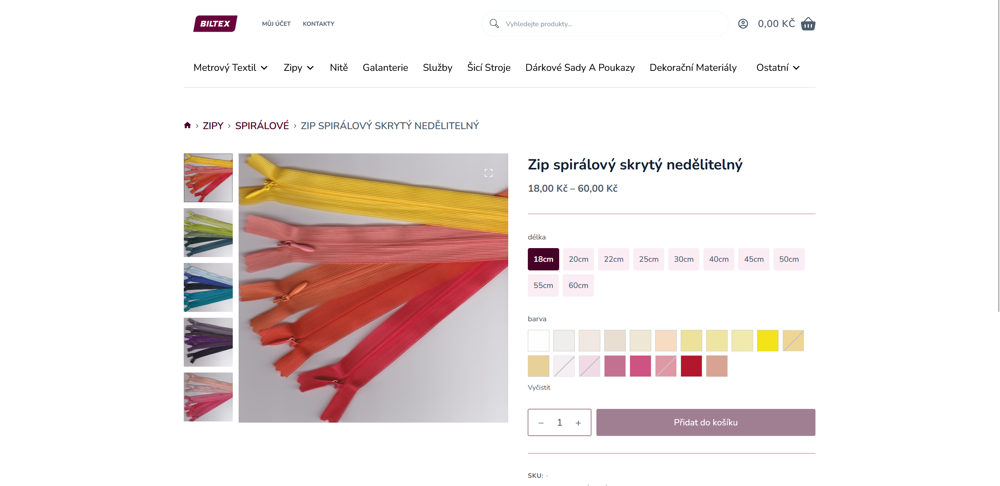
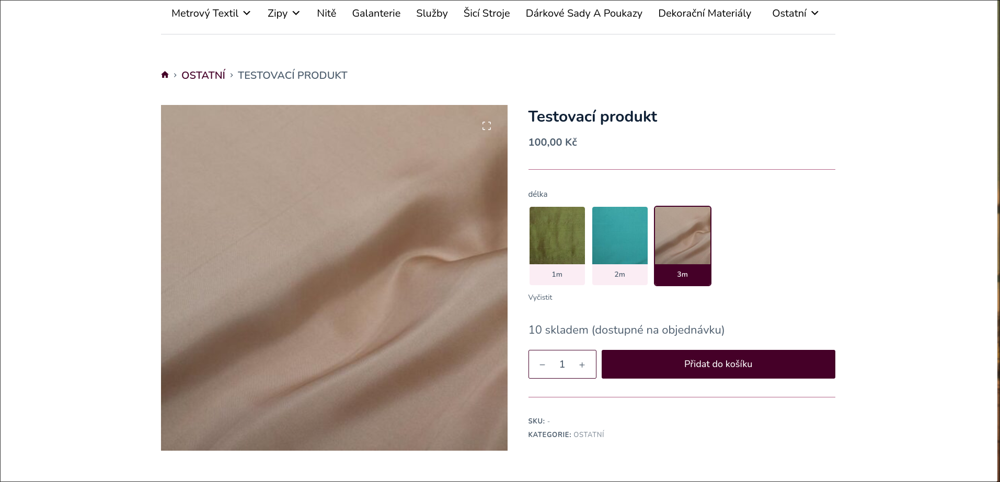

# Variants Display

Improve WooCommerce variation selectors.

## Description

Variants Display replaces standard WooCommerce variation dropdowns with customizable selectors.

Supported display styles:

- Default dropdown
- Pills
- Large cards
- Color/image swatches

Features:

- Configure display type per product attribute
- Color swatches with custom colors or variation images
- Support for taxonomy and custom attributes
- Dynamic unavailable variation handling
- Option to hide unavailable options completely

### Screenshots

| Color swatches | Tiles |
|:---:|:---:|
|||

## Installation

1. Upload the plugin to `/wp-content/plugins/` or download this repository as a ZIP and upload through Wordpress administration.
2. Activate it from the WordPress Plugins page
3. Edit a variable product and choose display types in the Attributes section

## Settings

Configure global options under:

`Settings -> Variants Display`

Available options:

- Show plugin entry in the admin menu
- Hide unavailable variants instead of disabling them

## Requirements

- WordPress 6.0+
- WooCommerce 7.0+
- PHP 8.0+
